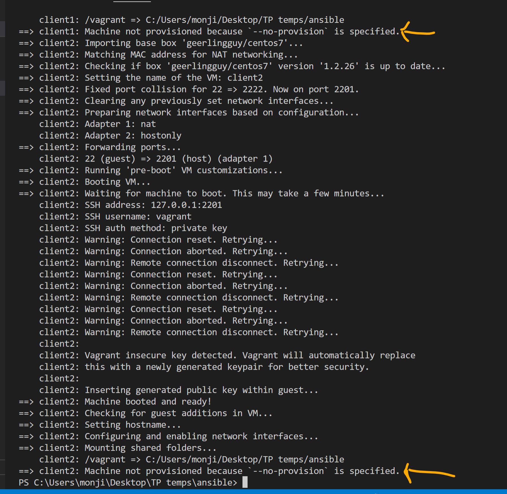
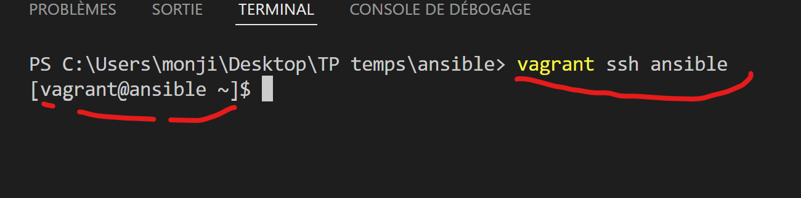

# Déploiement du labs
!!! -- Utilisation de Vagrant pour déployer trois VMs Centos 7 dans virtualbox

## Build des VMs

#### Prérequis
On part du principe que **virtualbox** et **vagrant** sont installés sur nos machines.
On travaille sur des postes windows. Du coup l'install suivane est pour des postes Windows : 
- **virtualbox** : 
    Télécgarger l'exécutable suivant et lancer l'assistant d'installation : 
    https://download.virtualbox.org/virtualbox/6.1.26/VirtualBox-6.1.26-145957-Win.exe

- **vagrant** :
    - Télécgarger l'exécutable suivant et lancer l'assistant d'installation  : https://releases.hashicorp.com/vagrant/2.2.18/vagrant_2.2.18_x86_64.msi
    - Ouvrir un terminal powershell et taper la commande  suivant pour vérifier l"installation: 
        vagrant --version

!!! -- Il se pourrait que le système vous demande de redémarrer votre machine, faites le dans ce cas.        

#### Creation du workspace sur le PC

Se créer un répertoire de travail sur son poste dans le quel on dépose le **Vagranfile** et son script de provisionning **install_ansible.sh**. Ce répertoire se nomme **ansible** dans notre cas. Les script sont fournis avec l'enoncé, dans le repertoire **ressources vagrant**


#### Lancement du build par des VMs vagrant
Ouvrir un terminal dans ce répertoire de travail et lancer la creation des VMs, *sans activer le provisioning* dans un premier temps. Dans notre cas, nous travaillons sur **vscode**.
```
vagrant up --no-provision
```    

La fin de l'exécution devrait ressembler à ceci :
 

Une fois le déploiement terminé, on aura trois VMs dans Virtualbox comme suit :

La Machine **ansible** correspond au serveur sur lequel on va installer ansible, **client1** et **client2** correspondent aux machines qui seront pilotées par ansible. En théorie ***on ne devrait jamais se connecter directement*** sur ces serveurs.

#### Connexion aux VMs
- On va se connecter au serveur ansible en passant par le binaire vagrant.
    ```
    vagrant ssh ansible
    ```    
    

- On pourrait aussi se connecter via une commande ssh normale. Les credentials sont : 
  - Nom d'utilisateur : **vagrant**
  - Password : **vagrant**
  - Adresse IP : **192.168.99.10** (confer le Vagrantfile)
    ```
    ssh vagrant@192.168.99.10
    ```