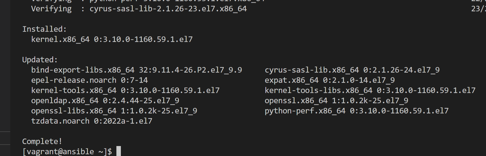
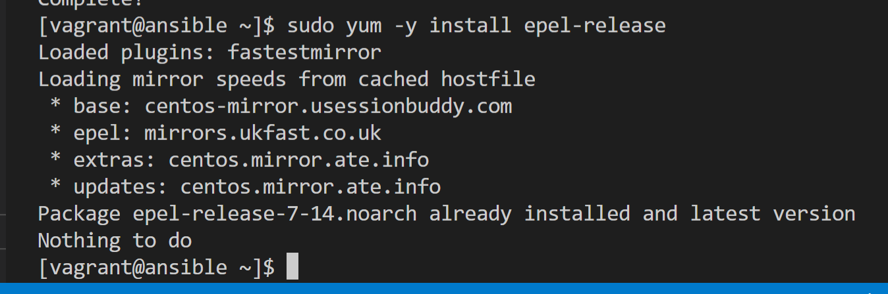
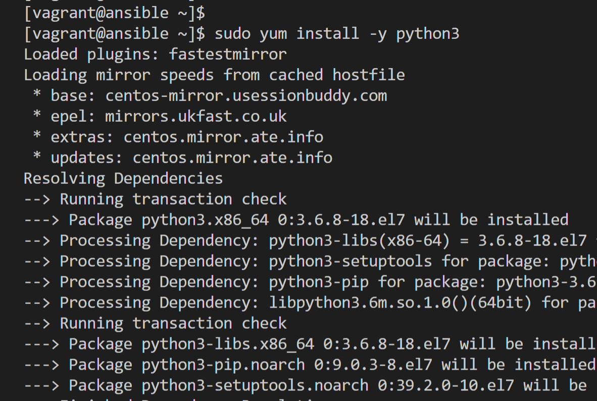
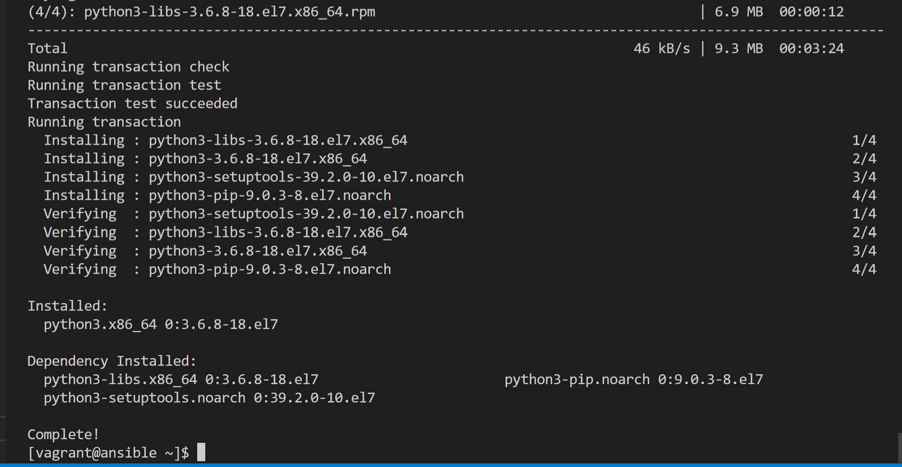
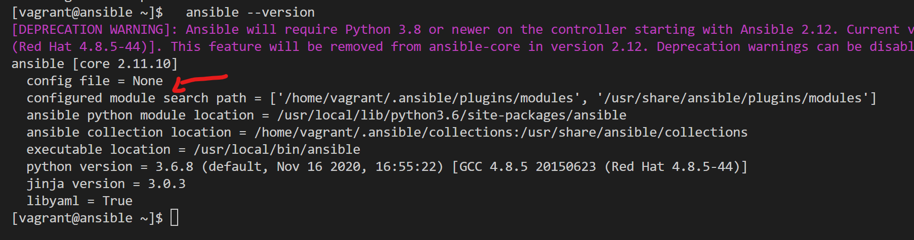
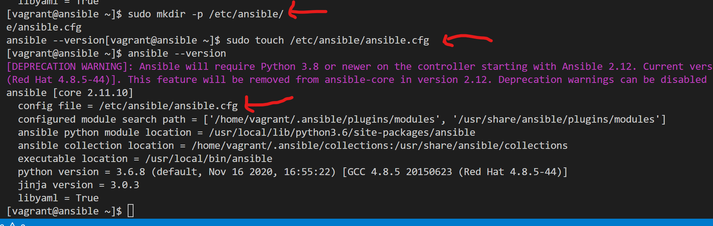
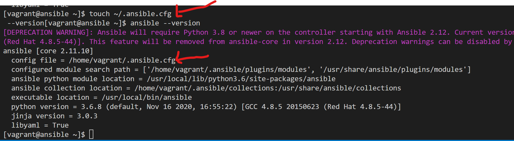
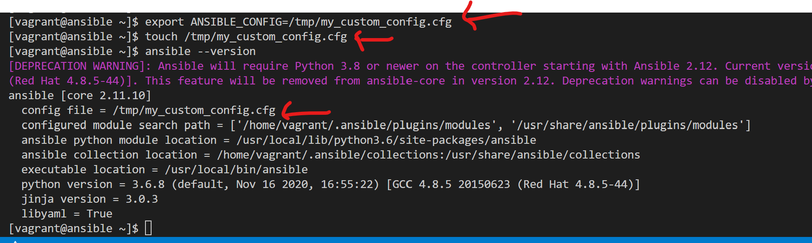

# Installation de Ansible

!!! --  Méthode via  pip3 
**pip3** c'est le gestionnaire de package de python3

#### Mise à jour du système
```
sudo yum -y update
```
  
#### Installation des  epel release (dépôt des packages aditionnels de redhat)  
```
sudo yum -y install epel-release
```

Dans notre cas le package était déja présent, rien à faire.
#### Installation de python3  
```
sudo yum install -y python3
```
  
  On a quelque chose qui ressemble à ceci à la fin
  

#### Installation de pip3   
```
curl -sS https://bootstrap.pypa.io/pip/3.6/get-pip.py | sudo python3
```
#### Installation de ansible via pip3  
```
pip3 install ansible  
```
  
  ou avec le **chemin complet** vers le binaire : 
```
/usr/local/bin/pip3 install ansible
```
#### Vérification de l'installation
```
ansible --version  
```



#### Installation de sshpass
Nativement, **ssh** ne donne pas la possibilité de fournir un mot de passe connexion de façon non interactive lors de la connexion. C'est voulu par les developpeurs car celà consititut une faille de sécurité. Du coup, afin d'apporter cette fonctionnalité, il est nécessaire d'avoir un outil tiers, en l'occurence **sshpass**. Pour l'installer, rien de plus simple : 
```
sudo yum -y sshpass
```
#### Surcharge du fichier de conf ansible.cfg

- **Premier niveau** : ***/etc/ansible/ansible.cfg*** 
```
sudo mkdir -p /etc/ansible/
sudo touch /etc/ansible/ansible.cfg
ansible --version
```


- **Deuxieme niveau** : ***~/.ansible.cfg***
```
touch ~/.ansible.cfg
ansible --version
```



- **Troisieme niveau** : ***${PWD}/ansible.cfg***
```
touch ${PWD}/ansible.cfg
ansible --version
```


- **Quatrième niveau** : variable d'env  ***ANSIBLE_CONFIG***
```
export ANSIBLE_CONFIG=/tmp/my_custom_config.cfg
touch /tmp/my_custom_config.cfg
ansible --version
```



#### Nettoyage de toutes les configurations
Afin de ne pas avoir de surprises dans la suites des TP, nous allons supprimer toutes ces confirutations.
```
sudo rm -rf /etc/ansible/ansible.cfg
rm -f ~/.ansible.cfg
rm -f ${PWD}/ansible.cfg
rm -rf /tmp/my_custom_config.cfg
unset ANSIBLE_CONFIG
```