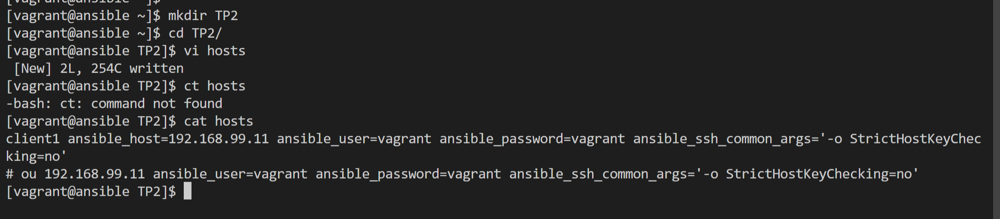
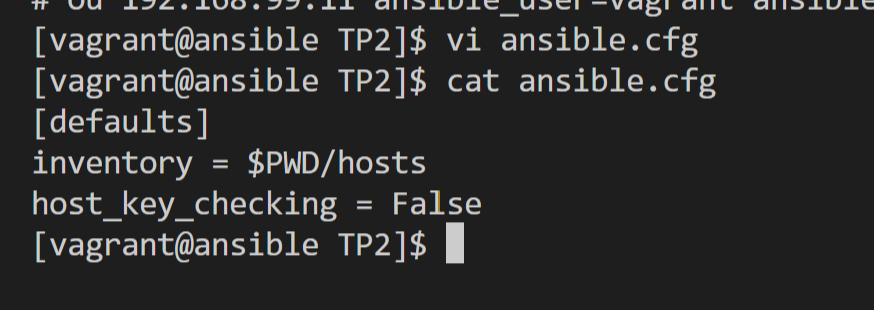
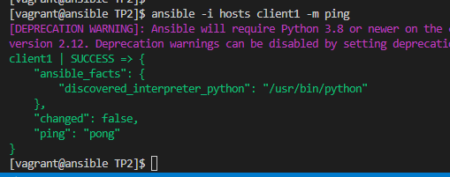
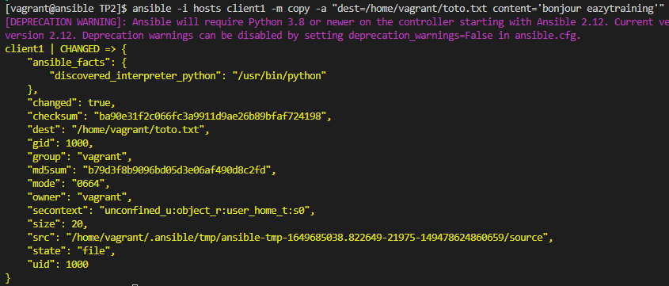
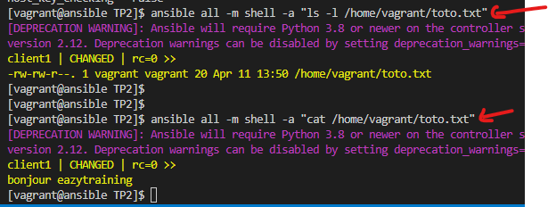
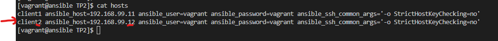
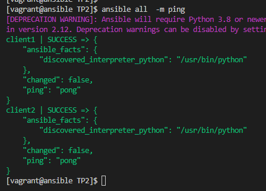
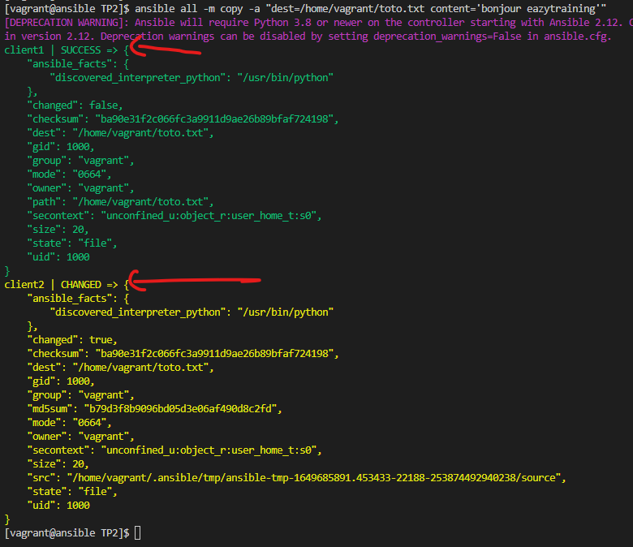
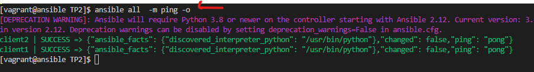
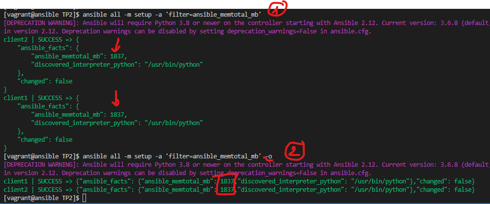

# Commandes ad hoc

##  Creation du projet ansible 
Sur le serveur **ansible**, créez un répertoire de travail **TP2** et se déplacer dans ce dernier, puis créez un fichier d’inventaire nommé **hosts** et un fichier de configuration **ansible.cfg**.

    mkdir TP2
    cd TP2/
    vi hosts
    vi ansible.cfg




!!! -- Les fichiers hosts et ansible.cfg sont fournis avec les instructions du TP  

## Tentative de ping du client en commande ad hoc
Il faut utiliser le module **ping** de ansible
```
ansible -i hosts client1 -m ping
```
ou alors sans l'option **-i hosts**  dans la mesure ou la variable **inventory = $PWD/hosts** est renseognée dans le fichier de configuration **ansible.cfg**. Ca donne ceci : 
```
ansible client1 -m ping
```


## Creation d'un fichier
Le module **copy** sera utilisé
```
ansible -i hosts client1 -m copy -a "dest=/home/vagrant/toto.txt content='bonjour eazytraining'"
```    


## Vérification du fichier
```
ansible all -m shell -a "ls -l /home/vagrant/toto.txt"
ansible all -m shell -a "cat /home/vagrant/toto.txt"
```     

## Ajout d'un client nommé client2
Il suffit d'éditer le fichier d'inventaire, nommé **hosts** dans notre cas.


## Tentative de ping des deux clients
```
ansible all  -m ping
```


## Creation du fichier sur les deux clients
ansible all -m copy -a "dest=/home/vagrant/toto.txt content='bonjour eazytraining'"


## Output de commande ad hoc sur une seule ligne par machine
```
ansible all  -m ping -o
```


## Test du module setup
```
ansible all  -m setup -o
```
## Récupération de la RAM
```
ansible all -m setup -a 'filter=ansible_memtotal_mb'
```
