## Inventaire ansible

#### 1 - Premier fichier host en format INI
!!! -- Demandez le fichier hosts.ini à votre formateur si vous avez du mal à le créer tout seul.

```
cd ~
mkdir TP4
cd TP4
cat hosts.ini
```
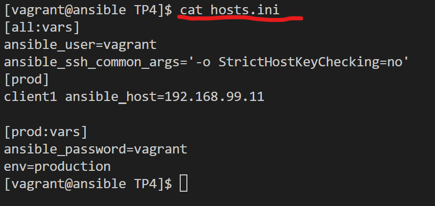

#### 2 - Du fichier INI au fichier YAML
- En utilisant la commande **ansible-inventory**
```
ansible-inventory  -i hosts.ini  --list -y
```
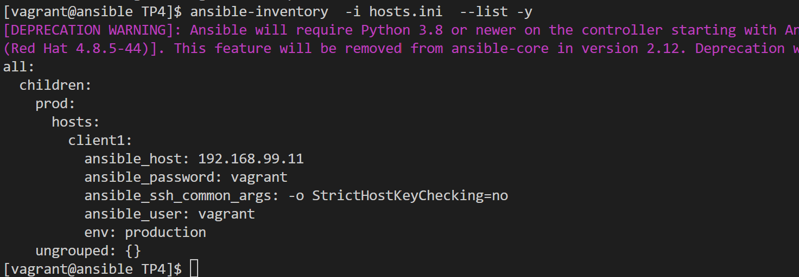
- Sinon, on peut aussi avoir le fichier yaml suivant: 

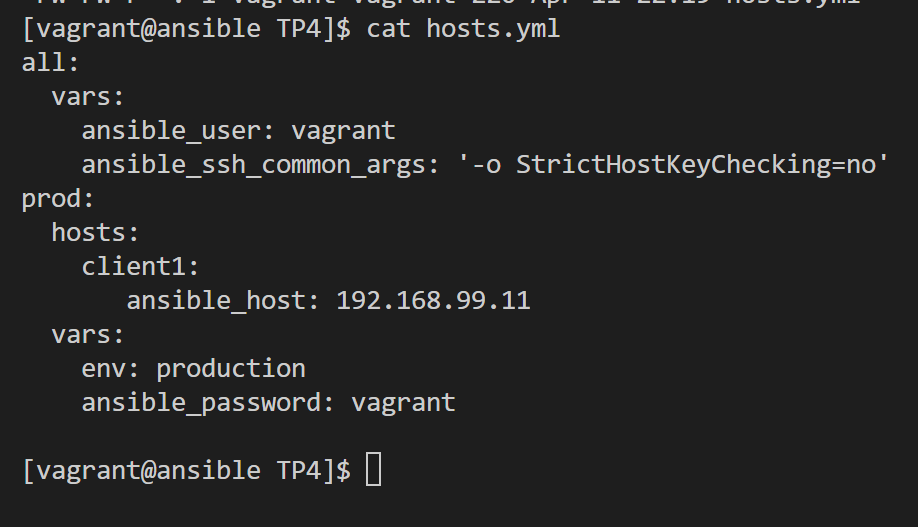

#### 3 - Refonte du fichier host.yml
Après refonte du projet, on voit apparaitre les répertoires **host_vars** et **group_vars**. Le fichier devient principal d'inventaire devient simplifié comme suit : 
```
mkdir -p host_vars group_vars
touch group_vars/all.yml group_vars/prod.yml host_vars/client1.yml
```


##### Contenu des group_vars
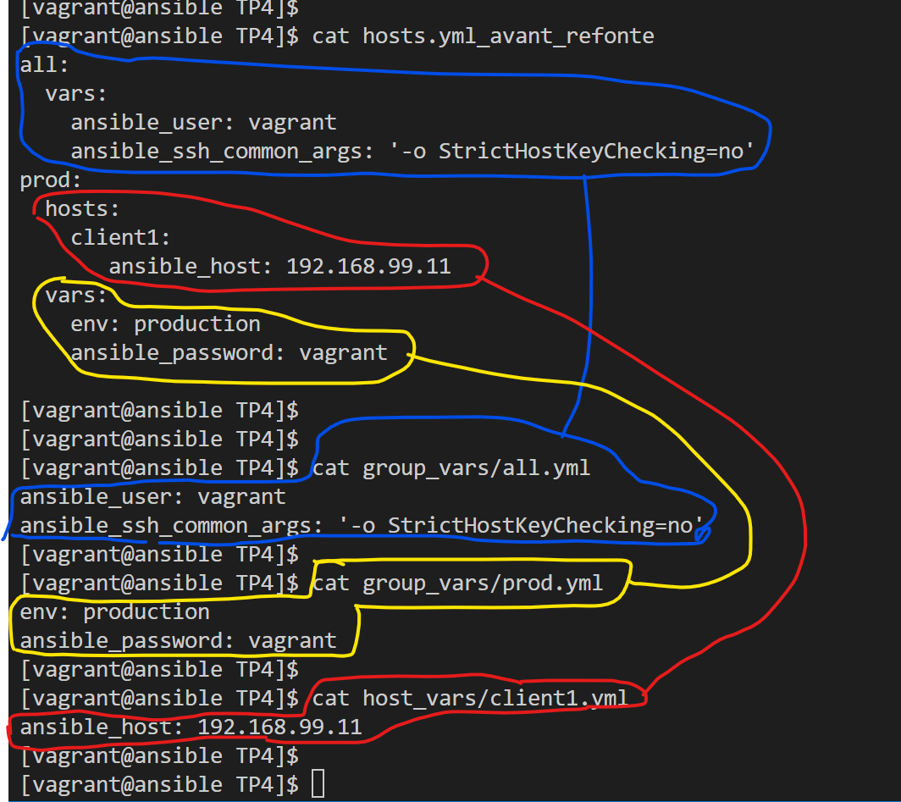

#### 4 - Affichage des machines via une commande ad hoc
Les commandes ad hoc peuvent  nous permettre d'interoger l'inventaire
```
ansible -i hosts.yml all --list-hosts
```
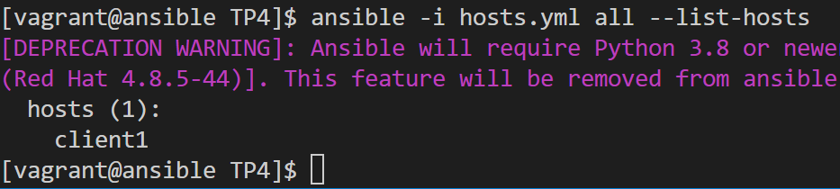

#### 5 - Affichage des machines du groupe prod via une commande ad hoc
```
ansible -i hosts.yml prod --list-hosts
```
#### 6 - Affichage de la machine client1 via une commande ad hoc
```
ansible -i hosts.yml client1 --list-hosts
```
#### 7 - Affichage de l'inventaire sous forme de graphe
```
ansible-inventory -i hosts.yml --graph
```
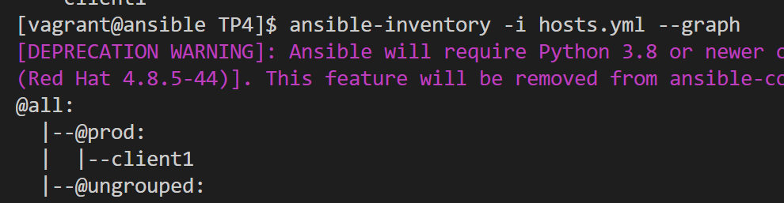
#### 8 - Affichage de des variables de la machine client1
```
ansible-inventory --host  client1
ansible-inventory -i hosts.yml --graph --vars
```
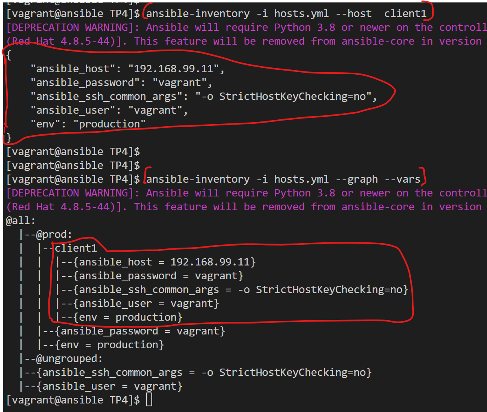

#### 9 - Changement du port d'ecoute du ssh sur le client
```
ansible -i hosts.yml --become client1 -m shell -a "sed -i 's/#Port 22/Port 2222/' /etc/ssh/sshd_config && systemctl restart sshd"
```
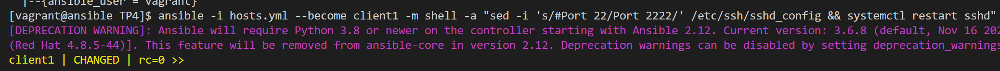

#### 10 - Test de commande ad hoc KO
```
ansible -i hosts.yml  client1 -m ping -o
ansible -i hosts.yml  all -m ping -o
```
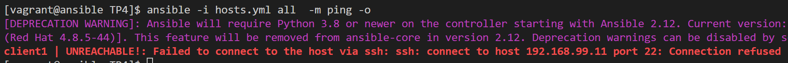
Le ping échoue, c'est normal car ansible tente toujours de se connecter via le port **22** par défaut du ssh. Il faudrait préciser à ansible que le port a changé.

#### 11 - Rajout du port 2222 dans l'inventaire dans le host_vars
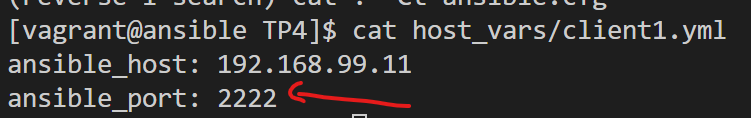

#### 12 - Ajout du serveur ansible dans l'inventaire
L'inventaire principal ressemblera à présent à ceci : 
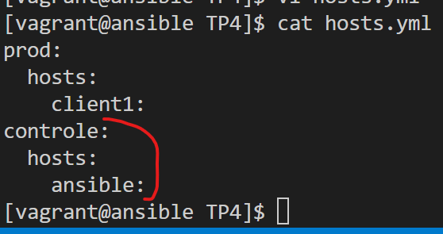

Il ya creation d'un fichier **host_vars/ansible.yml** pour les variables du serveur ansible
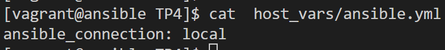

#### 13 - Test de ping sur tous les serveurs
```
ansible -i hosts.yml  all -m ping -o
```
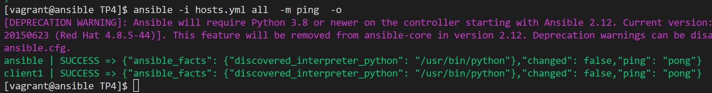

#### 14 - de YAML vers JSON
Nous allons utiliser un mini script python afin de transformer notre inventaire au format yaml en inventaire json. le fichie de sortie se nomme **hosts.json**
```
python3 -c 'import sys, yaml, json; json.dump(yaml.load(sys.stdin, Loader=yaml.FullLoader), sys.stdout, indent=4)' < hosts.yml > hosts.json
```
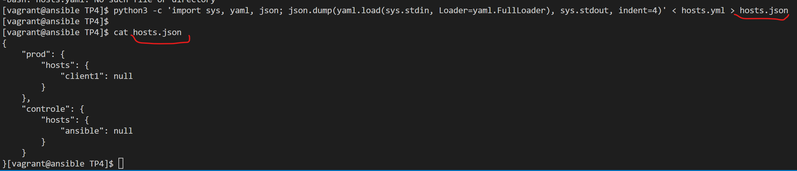

#### 15 - Test des commandes ad hoc avec l'inventaire json
```
ansible -i hosts.json  all -m ping -o
```
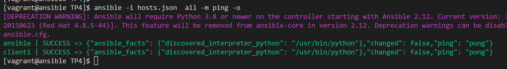

!!! -- Pensez à remettre le port d'ecoute du ssh sur le 22 pour la suite des autres TP
La commande pour celà : 
```
ansible -i hosts.yml --become  -e ansible_port=2222 client1 -m shell -a "sed -i 's/Port 2222/#Port 2222/' /etc/ssh/sshd_config && systemctl restart sshd"

```