### Partie 1 Mon premier playbook
#### Creation du projet ansible
```
cd ~
mkdir -p TP5/webapp
cd TP5/webapp
vi prod.yml
cat prod.yml
mkdir group_vars
vi group_vars/prod
cat group_vars/prod
mkdir host_vars
vi host_vars/client1
cat host_vars/client1 
```
- Vérifier bien que le fichier d'inventory ressemble à ceci : 
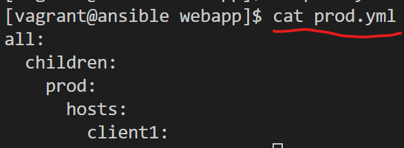

- Vérifier bien que le fichier group_vars de prod ressemble à ceci : 

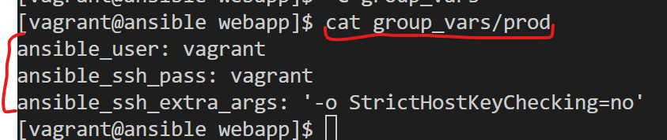

- un exemple de host_vars ressemble à ceci :

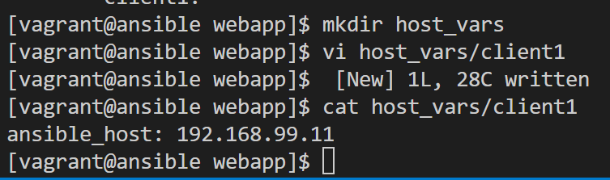

#### Installation de nginx manuellement

```
sudo yum install epel-release -y
sudo yum install nginx -y 
sudo systemctl start nginx
sudo systemctl enable nginx
```        

#### Creation du playbook d'installation de nginx
- Changeons le mots de passe root en "root" pour être plus 
Generation du hash du mot de passe
```
python -c 'import crypt; print crypt.crypt("root", "$1$SomeSalt$")'
```
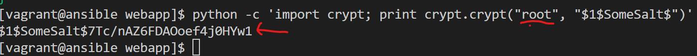
Le hash retourné est `$1$SomeSalt$7Tc/nAZ6FDAOoef4j0HYw1`

```
python -c "from passlib.hash import sha512_crypt; import getpass; print sha512_crypt.encrypt(getpass.getpass())"
```
- Changement du mot de passe via commande ansible ad hoc
```
ansible -i prod.yml all -m user -a "password=$1$SomeSalt$7Tc/nAZ6FDAOoef4j0HYw1 name=root" --become
```


- Creation du playbook **nginx.yml**
```
vi nginx.yml
cat nginx.yml
```
Le playbook devrait ressembler à ceci : 
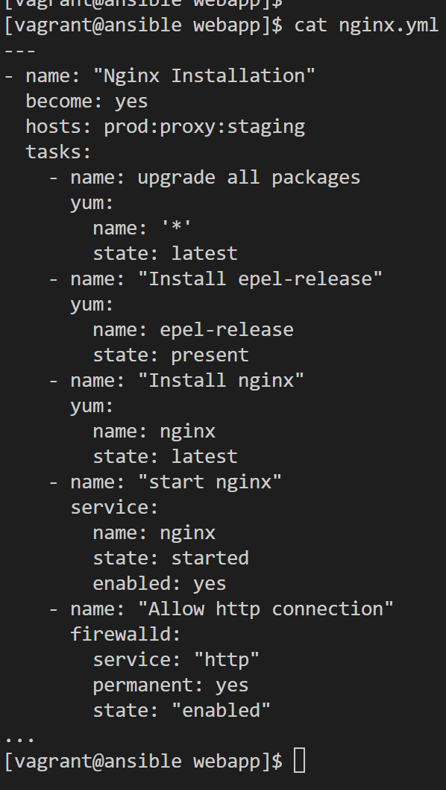

L'exécution de playbook donne ceci
```
ansible-playbook -i prod.yml nginx.yml
```
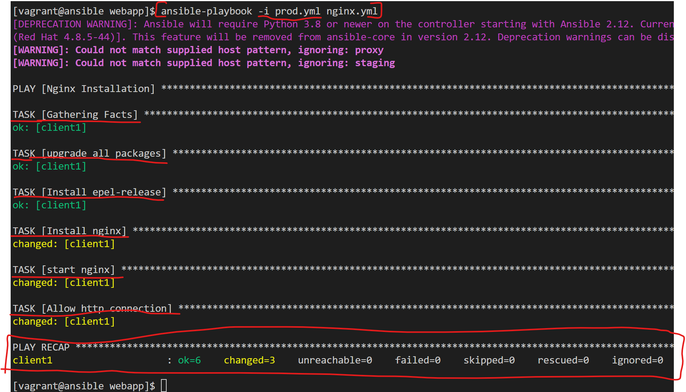

### Partie 2 : plus de playbook pour prendre la main
#### Playbook webapp.yml
```
vi webapp.yml
cat webapp.yml
ansible-playbook -i prod.yml webapp.yml
```
Il ressemble à ceci : 
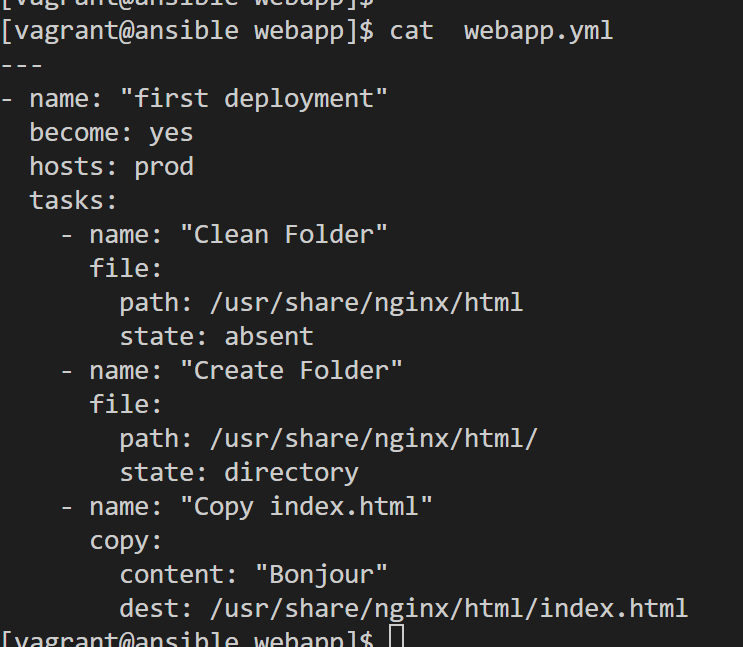

Et son execution donne à ceci : 
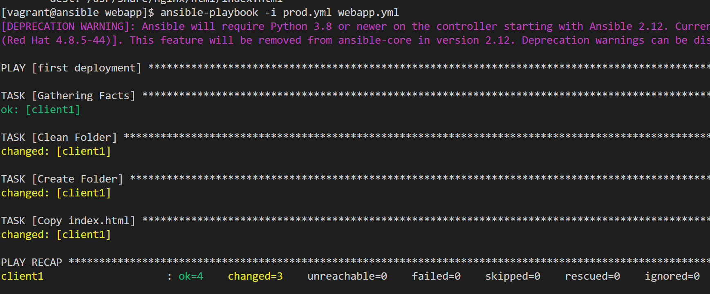

A présent, il est question de tester que le site fonctionne. 
Nous allons vérifier dans notre navigateur avec [l'ip du client1 comme url](http://192.168.99.11). On a ceci :


#### Playbook webapp-v2.yml
```
vi webapp-v2.yml
cat webapp-v2.yml
ansible-playbook -i prod.yml webapp-v2.yml
```
Il ressemble à ceci : 

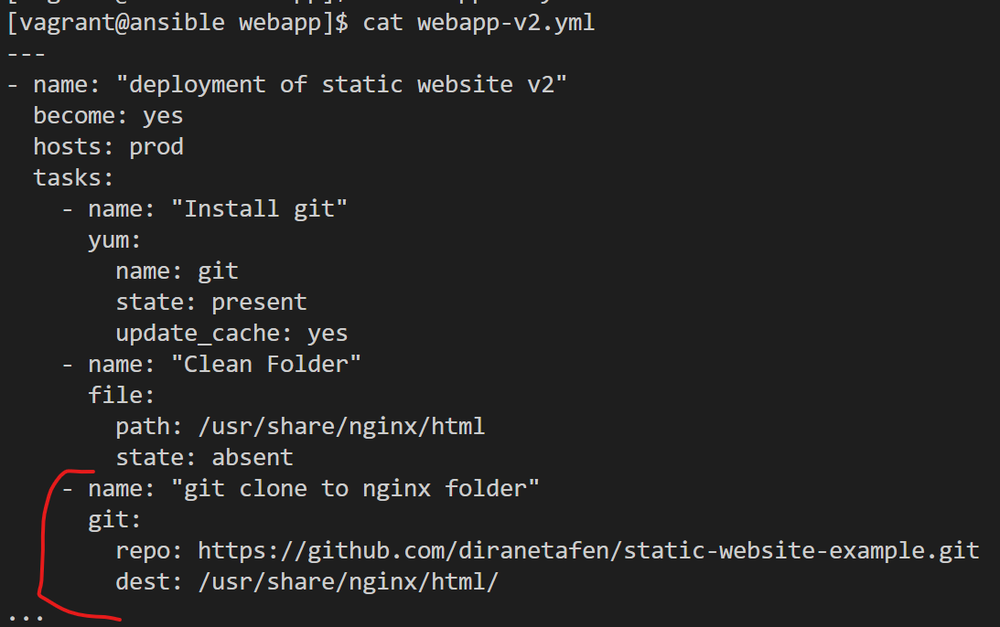

Et son execution donne à ceci : 
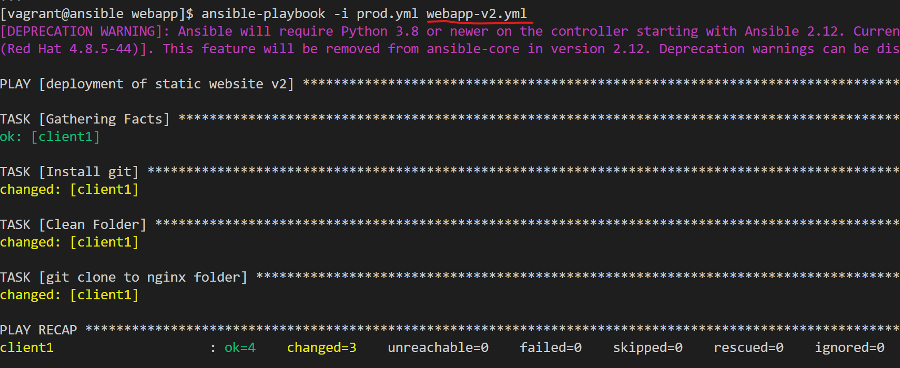

[Dans le navigateur](http://192.168.99.11), on a ceci : 

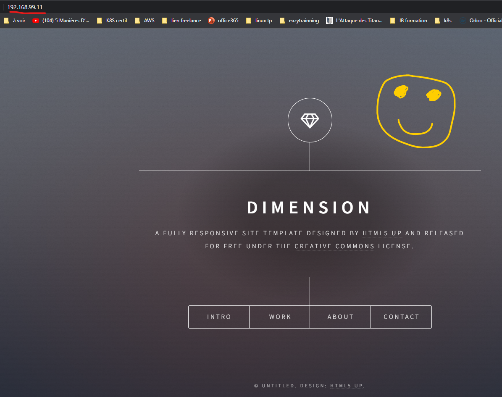

#### Playbook principal deploy-webapp.yml
```
vi deploy-webapp.yml
cat deploy-webapp.yml
ansible-playbook -i prod.yml deploy-webapp.yml
```

Il ressemble à ceci : 
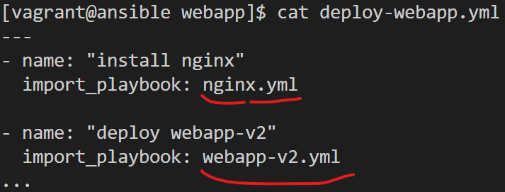

Et son execution donne à ceci : 
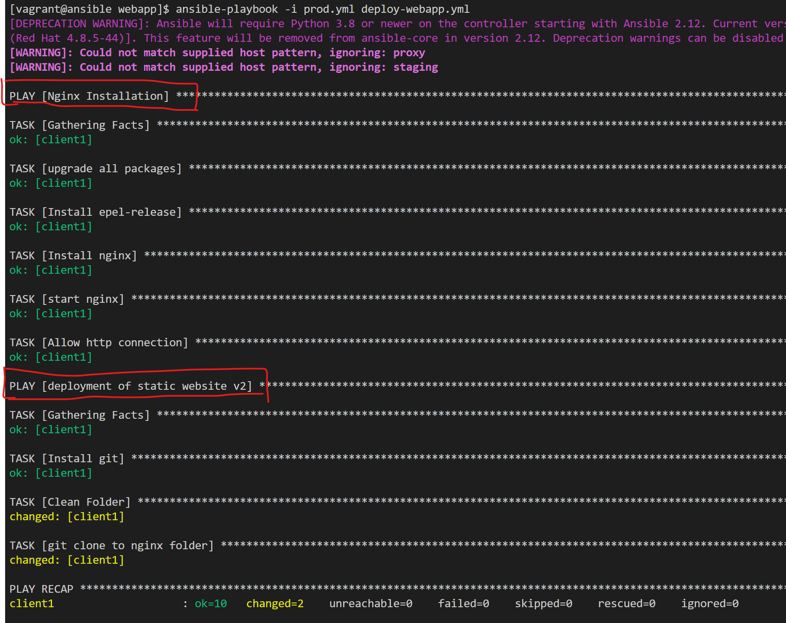

A ce stade, aucun changement à constater [dans le navigateur](http://192.168.99.11).

Pour finir proprement, je vais rajouter un **ansible.cfg** dans mon projet qui ressemblera à ceci : 
```
sudo yum install tree -y
cat ansible.cfg
```
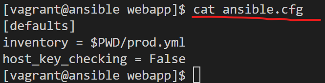

Et mon projet ansible devrait ressembler à ceci :
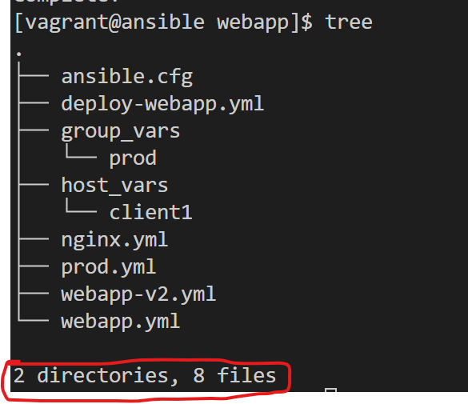

### Partie 3 : Template Jinja et conditions
#### Modification de l'inventaire
- Fichier **prod.yml**

Il ressemblera à ceci :

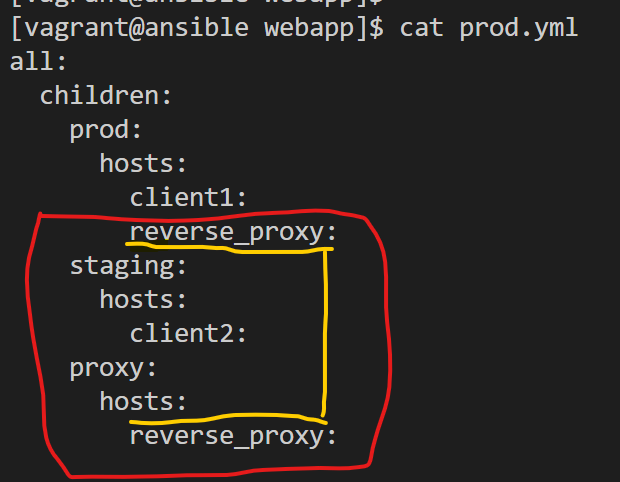

- Fichier **host_vars/client2**

Il ressemblera à ceci :

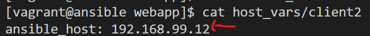

- Fichier **host_vars/reverse_proxy**

Il ressemblera à ceci :

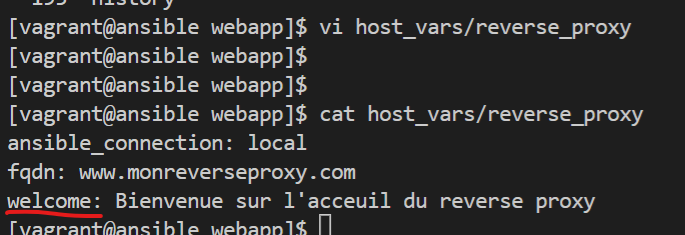

- Fichier **group_vars/all**, il faut biensur configurer l'authentification des autres machines
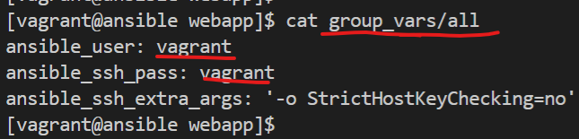


A ce stade mon projet qui ressemblera  à ceci :

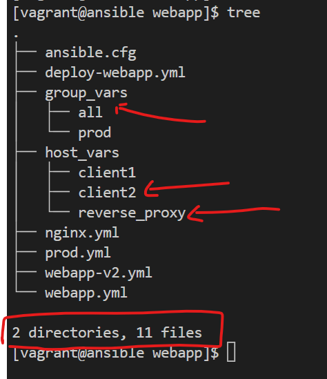

#### Playbook webapp-v3.yml
```
vi webapp-v3.yml
cat webapp-v3.yml
ansible-playbook webapp-v3.yml
```
Il ressemble à ceci : 

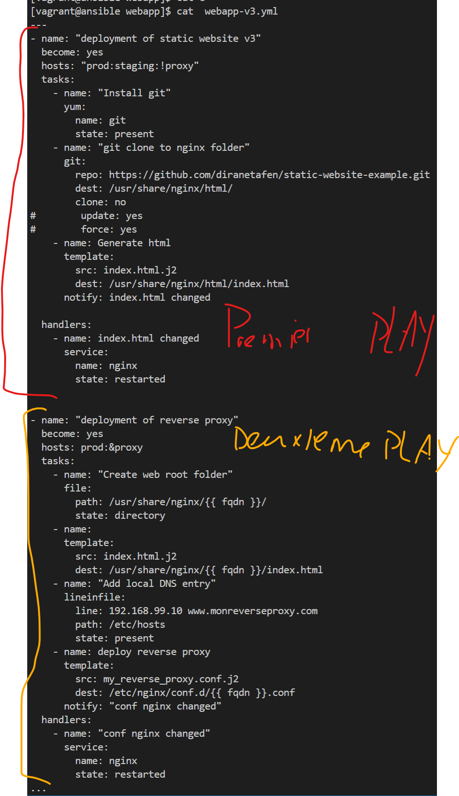

Avant de l'exécuter, ne pas oublier de créer les fichier de templates. Ils vous sont donné avec l'enoncé
```
mkdir templates
vi templates/index.html.j2
vi templates/my_reverse_proxy.conf.j2
```

Et son execution donne à ceci : 

![](images/webapp_playbook_v3